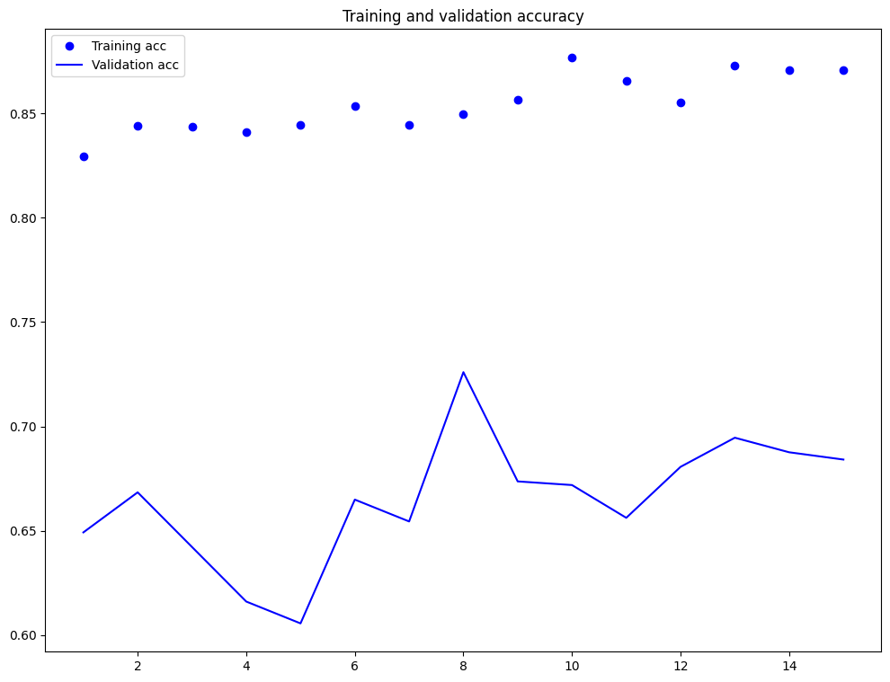
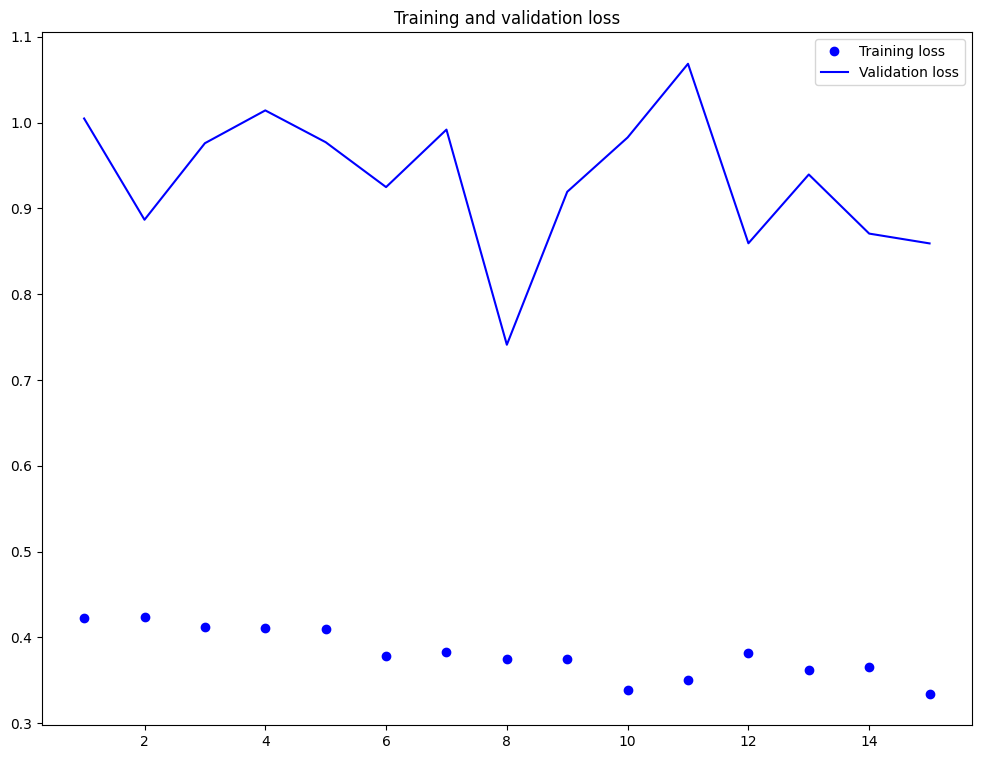

# Brain Tumor Detection Using Deep Learning

This repository contains a complete brain tumor detection system, including three deep learning models for detecting and classifying brain tumors using MRI brain scans and a web application for real-time analysis.

## Table of Contents
- [Overview](#overview)
- [Models](#models)
- [Web Application](#web-application)
- [Dataset](#dataset)
- [Requirements](#requirements)
- [Installation](#installation)
- [Usage](#usage)
- [Recent Updates](#recent-updates)
- [Results](#results)
- [Contributing](#contributing)
- [License](#license)

## Overview

Brain tumor detection is essential for early intervention, and deep learning offers promising results in MRI analysis. This project includes:

1. **Three Deep Learning Models**: Custom CNN, VGG16, and ResNet50 for brain tumor classification
2. **Web Application**: A Flask-based interface for uploading and analyzing MRI scans
3. **Results Dashboard**: Visualization of analysis results and historical data
4. **Report Generation**: PDF and CSV export capabilities

## Models

### 1. Custom CNN with Caltech101
- **Dataset**: Caltech101, tailored for brain tumor classification
- **Architecture**: Custom CNN optimized for brain imaging
- **Training**: Uses data augmentation

### 2. VGG16 Transfer Learning
- **Architecture**: VGG16 with modified layers for binary classification
- **Pre-trained on**: Large datasets, fine-tuned for MRI
- **Advantages**: Adapted for tumor classification

### 3. ResNet50 Transfer Learning
- **Architecture**: ResNet50 with skip connections for better gradient flow
- **Training**: Fine-tuned specifically for medical imaging
- **Advantages**: Enhanced performance via skip connections

## Web Application

The project includes a comprehensive web application with the following features:

### Key Features
- **MRI Scan Upload**: Easily upload brain MRI scans for analysis
- **Real-time Analysis**: Instant classification using the pre-trained ResNet50 model
- **Interactive Dashboard**: View statistics, recent scans, and confidence levels
- **Responsive Design**: Works seamlessly on desktops, tablets, and mobile devices
- **Dark/Light Mode**: Toggle between display modes for comfortable viewing

### Components
1. **Home Page**: Upload interface with instructions and sample images
2. **Results Page**: Detailed analysis with confidence scores and tumor highlighting
3. **Dashboard**: Statistics, recent scan history, and export options
4. **About Page**: Information about the project and technology used

### Reporting
- **PDF Reports**: Generate detailed reports for individual scans
- **CSV Export**: Download all scan data for further analysis

## Dataset

The models are trained and evaluated on a brain MRI dataset containing four classes:
- Glioma Tumor
- Meningioma Tumor
- No Tumor
- Pituitary Tumor

Use the provided dataset or configure paths in the configuration file if using a custom dataset.

## Requirements

All required packages are listed in `requirements.txt`. Install them as follows:

```bash
pip install -r requirements.txt
```

Key dependencies include:
- Flask
- TensorFlow
- OpenCV
- SQLite
- ReportLab (for PDF generation)
- NumPy
- Pandas

## Installation

1. Clone the repository:
   ```bash
   git clone https://github.com/Brain-Tumor-Detection/BrainTumorDetection.git
   cd Brain-Tumor-Detection
   ```

2. Install dependencies:
   ```bash
   pip install -r requirements.txt
   ```

3. Download and place the dataset in the specified folder.

4. Start the web application:
   ```bash
   python app.py
   ```

## Usage

### Web Application
1. Run the Flask application:
   ```bash
   python app.py
   ```
2. Open your browser and navigate to `http://localhost:5000`
3. Upload an MRI scan image and view the results
4. Visit the dashboard to see statistics and history

### Machine Learning Models
1. **Run the Notebooks in Jupyter**:
   - Open each notebook in Jupyter Notebook or JupyterLab to run the models:
     - `Custom_CNN_Training.ipynb`
     - `VGG16_Transfer_Learning.ipynb`
     - `ResNet50_Transfer_Learning.ipynb`

2. **Command Line Execution**:
   - You can run the notebooks from the command line by converting them to Python scripts:
     ```bash
     jupyter nbconvert --to script Custom_CNN_Training.ipynb
     python Custom_CNN_Training.py
     ```

### Configuration
Update configuration files to specify training parameters like learning rate, batch size, and data paths.

## Recent Updates

- **Dashboard Improvements**: Fixed issues with progress bars in the dashboard to correctly display confidence levels
- **UI Optimization**: Removed empty analytics section from the dashboard to improve user experience
- **File Input Reference**: Fixed file input reference in the HTML to correctly match the element ID
- **Responsive Design Improvements**: Enhanced mobile compatibility across all pages

## Results

Training and validation loss metrics are visualized below:





The ResNet50 model achieved the highest accuracy of 97.3% on the validation dataset, making it the primary model used in the web application.

## Contributing

Fork the repository, make changes, and submit a pull request. Ensure code is documented and tested.

## License

Licensed under the MIT License. See the LICENSE file for more details.
